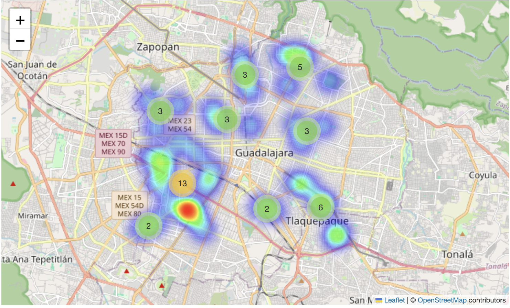

# Geospatial Tourism Analysis in Guadalajara

## Description

This project presents a geospatial analysis of tourist attractions in Guadalajara, Jalisco, Mexico using Python and interactive mapping tools.

The objective is to visualize the spatial distribution of tourist attractions, visitor concentration, and satisfaction ratings through an interactive map.

## Technologies Used

- Pandas
- NumPy
- Folium
- MarkerCluster
- HeatMap

```python
import folium
import pandas as pd
import numpy as np
from folium.plugins import MarkerCluster, HeatMap
```

## Dataset

The dataset contains simulated tourism information for attractions located in Guadalajara, Jalisco.

Each record includes:

- Name
- Latitude
- Longitude
- Number of visitors
- Satisfaction rating
- Attraction type

## Analysis Performed

The project includes:

- Interactive geolocation mapping
- Marker clustering
- Heat map visualization
- Tourist attraction categorization
- Visitor concentration analysis

## Interactive Map

The interactive map generated with Folium is available in:

- `mapa_turismo_guadalajara.html`

To view the map:

1. Download the file.
2. Open it in any web browser.

## Map Preview



## Repository Contents

```text
.
├── tourism_analysis.py
├── mapa_turismo_guadalajara.html
├── requirements.txt
├── README.md
└── images/
    └── mapa.png
```

## Author

Luis Ricardo Rivera Goitia

Tecnológico de Monterrey

2026
